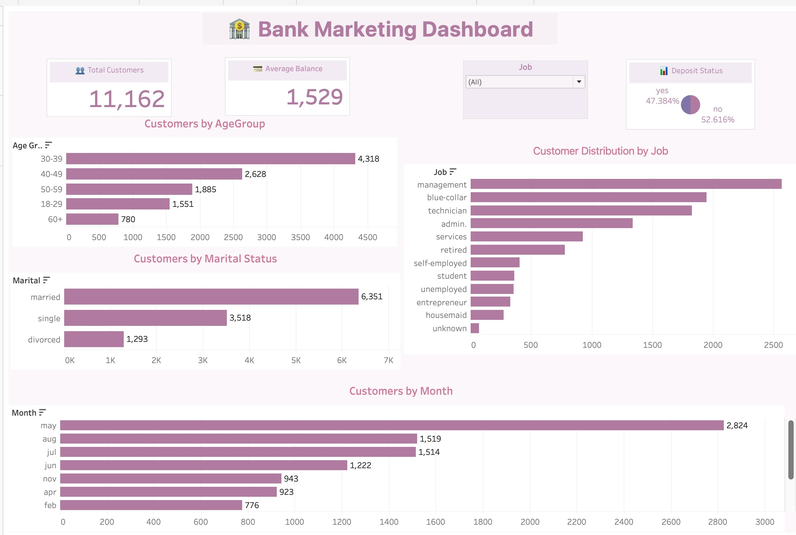

# bank-marketing-tableau-dashboard
Data visualization project using Tableau featuring KPIs, interactive filters, and customer insights from the Bank Marketing dataset.
# 📊 Bank Marketing Dashboard | Tableau

## 📌 Project Overview

This project presents an interactive Tableau dashboard built using the Bank Marketing dataset. The dashboard provides insights into customer demographics, account balances, and deposit subscription trends through interactive visualizations and filters.

---

## 🎯 Objectives

- Analyze customer demographics
- Explore deposit subscription rates
- Identify trends across age groups, jobs, and marital status
- Create an interactive dashboard for business decision-making

---

## 🛠️ Tools Used

- Tableau Public / Tableau Desktop
- CSV Dataset
- Data Visualization
- Interactive Dashboards

---

## 📁 Project Structure

```
TABLEAU/
│
├── Dashboard/
│   └── dashboard.png
│
├── Dataset/
│   └── bank.csv
│
├── Tableau_Bank_Marketing.twbx
│
└── README.md
```

---

## 📊 Dashboard Features

The dashboard includes:

- ✅ Total Customers KPI
- ✅ Average Balance KPI
- ✅ Deposit Subscription Status
- ✅ Customers by Age Group
- ✅ Customers by Job
- ✅ Customers by Marital Status
- ✅ Customers by Month
- ✅ Interactive Filters

---

## 📷 Dashboard Preview

> Dashboard screenshot



---

## 📈 Key Insights

- Most customers belong to the 30–39 age group.
- Management is the most common occupation.
- Married customers represent the largest customer segment.
- Customer activity varies across different months.
- The dashboard enables interactive exploration using filters.

---

## 📂 Dataset

Dataset: **bank.csv**

---

## 🚀 Skills Demonstrated

- Data Visualization
- Dashboard Design
- KPI Creation
- Interactive Filters
- Business Insights
- Data Storytelling

---

## 👩‍💻 Author

**Sahar**

Aspiring Data Analyst building projects in:

- Excel
- SQL (MySQL)
- Python (Pandas)
- Tableau
